# Supply Chain X-Ray

**Which of your applications does a published vulnerability actually reach, through what chain of transitive dependencies, and which single dependency do you bump to cut it off?**

A graph database application built on [CognoDB](https://console.cognodb.com), backed by real data from the npm registry and [OSV.dev](https://osv.dev). Six applications, 1,019 packages, 1,234 installed versions, 2,057 dependency edges, 126 advisories.

- **Live demo:** _(deploying — link to follow)_
- **Screen recording:** _(to follow)_

---

## The problem

Run `npm install` on a modern web app and you get somewhere between 200 and 1,500 packages. You chose ten of them. The rest arrived because something you chose depended on something else, which depended on something else.

Then an advisory lands for a package you have never heard of, and the only questions that matter are unanswerable by inspection:

- Does it actually reach my production code, or is it a dev-only dependency of a dev-only dependency?
- How did it get in — what chain of packages is responsible?
- Which of the ten dependencies I *do* control should I bump to cut it off?
- If one npm account were compromised today, how much of my software could that person publish to?

Every one of these is a question about *connections*, and the answer to most of them is a **path** — an ordered chain of packages — not a number and not a row.

This application answers them. The clearest finding in the seeded data:

> `legacy-admin` → `handlebars@4.1.0` → `optimist@0.6.1` → `minimist@0.0.10`

Nobody chose `minimist 0.0.10`. Handlebars did, via optimist, three hops down, and it carries a prototype-pollution advisory. That chain is the product in one line.

---

## Why a graph database?

The brief asked for a problem where a graph genuinely earns its place. Five specific reasons it does here, and one where it does not.

### 1. The answer is a path, and a relational result set has no path type

The core query returns `["handlebars@4.1.0", "optimist@0.6.1", "minimist@0.0.10"]` — an ordered chain of unknown length. In Cypher:

```cypher
MATCH p = (root)-[:DEPENDS_ON*0..8]->(dep)
RETURN [n IN nodes(p) | n.id] AS chain
ORDER BY length(p) ASC LIMIT 1
```

In SQL you write a recursive CTE that emits one row per hop, carry an array column to accumulate the path, guard against cycles yourself, then reassemble the chain in application code. The database cannot hand you the answer; it can only hand you the pieces.

### 2. The same edges answer the question in both directions

"Which advisories reach `storefront-web`?" and "Which apps does `GHSA-vh95` reach?" are the same relationships read two ways. Nothing was added to the model to make the reverse direction work — compare `VULNERABLE_PATHS` and `EXPOSED_APPS` in [`src/lib/queries/`](src/lib/queries/). Relationally these are two different recursive queries with different join orders over the same tables, both of which must be maintained.

### 3. Depth is a property of the traversal, not of the data

`minimist@0.0.10` is not "at depth 3" — it is at depth 3 *from `legacy-admin`*, and at no depth at all from the other five applications. There is no column this belongs in. Every depth figure in the application is a property of a walk from a particular starting point.

### 4. Set intersection over several transitive closures

"Which packages do two or more applications depend on without any of them having chosen it?" ([`/packages`](src/app/packages/page.tsx)) intersects six reachability sets and compares minimum depths. In SQL that is one recursive CTE per application and then a join across all their results. Here it is one pattern:

```cypher
MATCH (pkg:Package)-[:HAS_VERSION]->(v:Version)<-[reach:REACHES]-(app:App)
RETURN pkg.name, count(DISTINCT app) AS appsReached, min(reach.depth) AS minDepth
```

The answer: `hasown` reaches **5 of the 6 applications at depth 3**, and **148 of the shared packages were declared by nobody**.

### 5. Where relational would be fine

Not everything here needs a graph. `Package → Version` is a plain one-to-many. Maintainer lists are a join table. Counting packages is `SELECT COUNT(*)`. A graph is the right choice because the *interesting* half of this application is traversal-shaped, not because every query is.

One caveat worth naming rather than glossing over: the nesting-depth aggregate is **materialised** at load time as `(:App)-[:REACHES {depth}]->(:Version)` rather than traversed live — see [Performance](#performance). That is a transitive closure cached for hot reads, a standard graph technique, but it means not every figure on screen is computed on demand. The queries that return *paths* all are, because there is nothing about a path to precompute.

---

## Data model

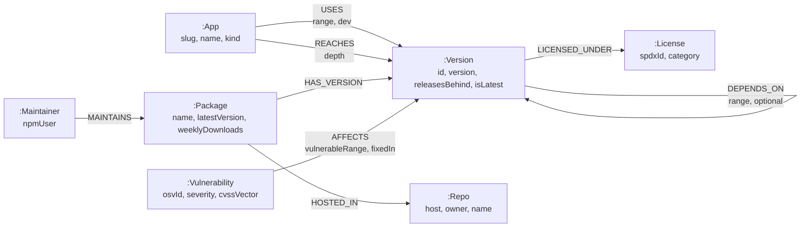

| Node / relationship | Count |
|---|---|
| `:Package` | 1,019 |
| `:Version` | 1,234 |
| `:Maintainer` | 821 |
| `:Vulnerability` | 126 |
| `:Repo` | 691 |
| `:App` | 6 |
| `DEPENDS_ON` | 2,057 |
| `MAINTAINS` | 2,807 |
| `REACHES` | 992 |
| `AFFECTS` | 132 |

### The modelling decisions that change the answers

**`Version` is its own node, not a property of `Package`.** This is the load-bearing decision. Advisories affect version *ranges*, not packages — `GHSA-p6mc` affects lodash `>=3.7.0 <4.17.19`. Hanging `AFFECTS` off `Package` would report every lodash user as vulnerable including those already on 4.17.21, making every answer a false positive.

**`DEPENDS_ON` has no `dev` flag; `USES` does.** npm does not install the devDependencies of your dependencies — only of the root project. So a dev edge below the root does not exist in any real install tree, and it is not in this graph either. The flag lives on `USES`, where the distinction is real — a field that is always `false` invites being trusted.

**peerDependencies are not followed.** A peer is satisfied by a version already elsewhere in the tree; adding an edge for it would double-count.

**The tree is an *install* tree, not a manifest tree.** Ranges are resolved to the single version npm would actually pick (highest satisfying), so the graph describes what lands on disk.

**Maintainers come from each package's *current* metadata,** not the historical maintainer list on whichever old version happens to be installed. The trust question is "who holds the keys today", not "who held them in 2019".

**Licences come from each resolved version's own document.** A package's licence can change between releases, and the applications pinning old releases are exactly the ones the licence query is about.

---

## Screenshots

### Portfolio overview
Every application, its full install tree, and every advisory that reaches it.

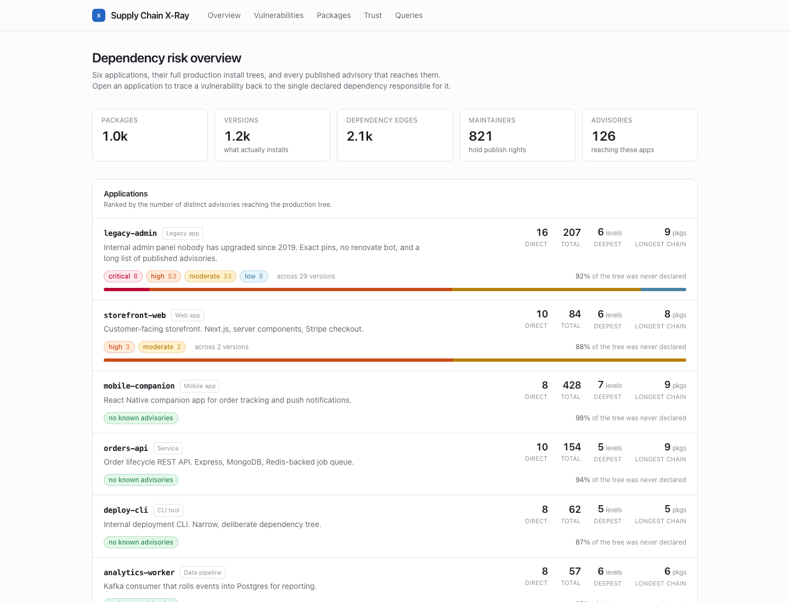

### Blast radius — the chain is the product
`storefront-web` → `next@15.5.22` → `postcss@8.4.31`. One direct dependency carries all five findings. Below it, the license panel traces LGPL binaries four hops down.

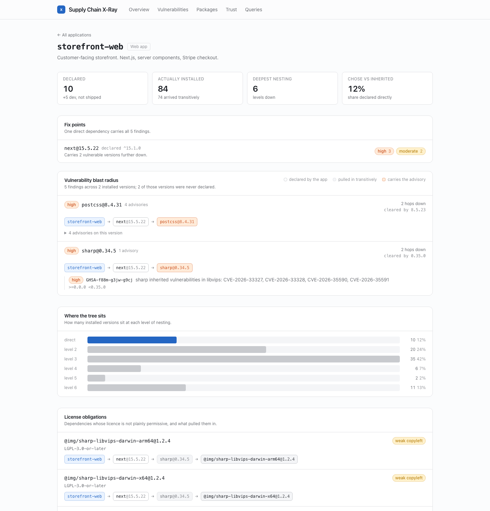

### Fix points
16 direct dependencies carry all 105 findings, and the three biggest account for 62 of them. Triage rather than a wall of CVEs.

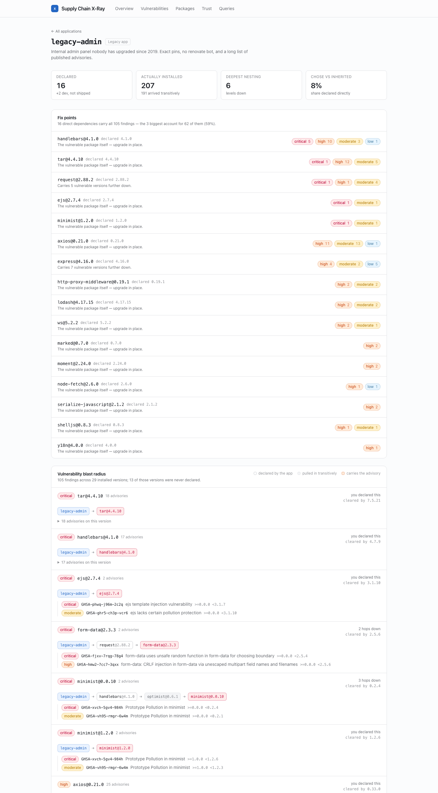

### A clean application
Four of the six applications have no advisories at all, so the clean state is designed rather than incidental.

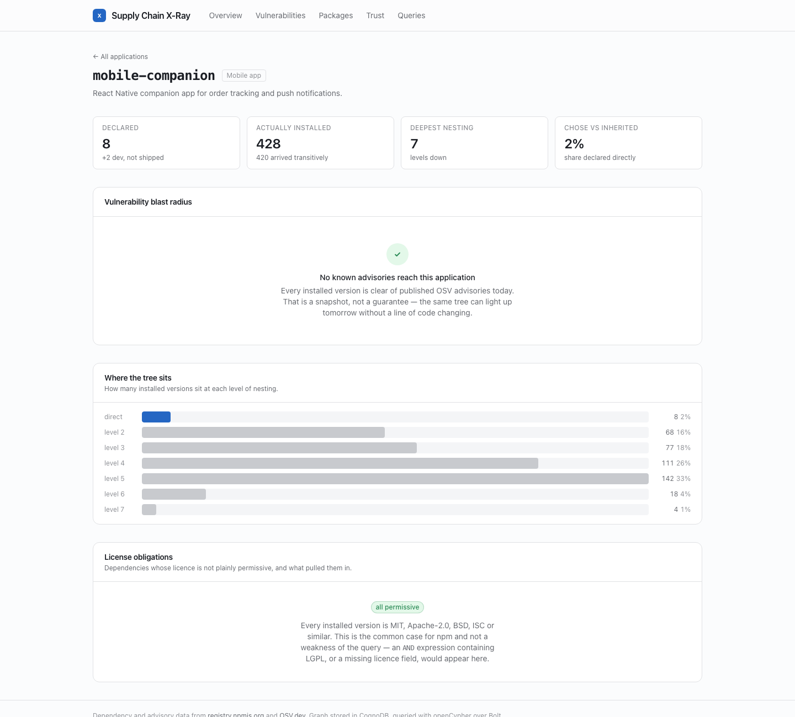

### Advisories, and who is exposed
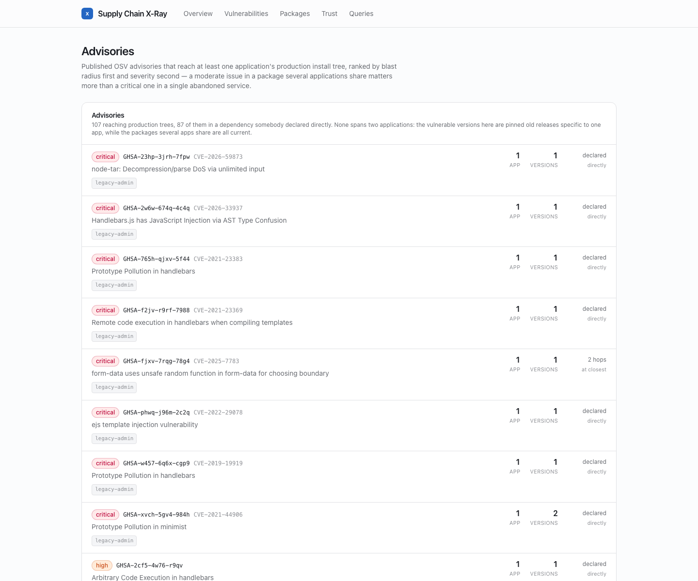

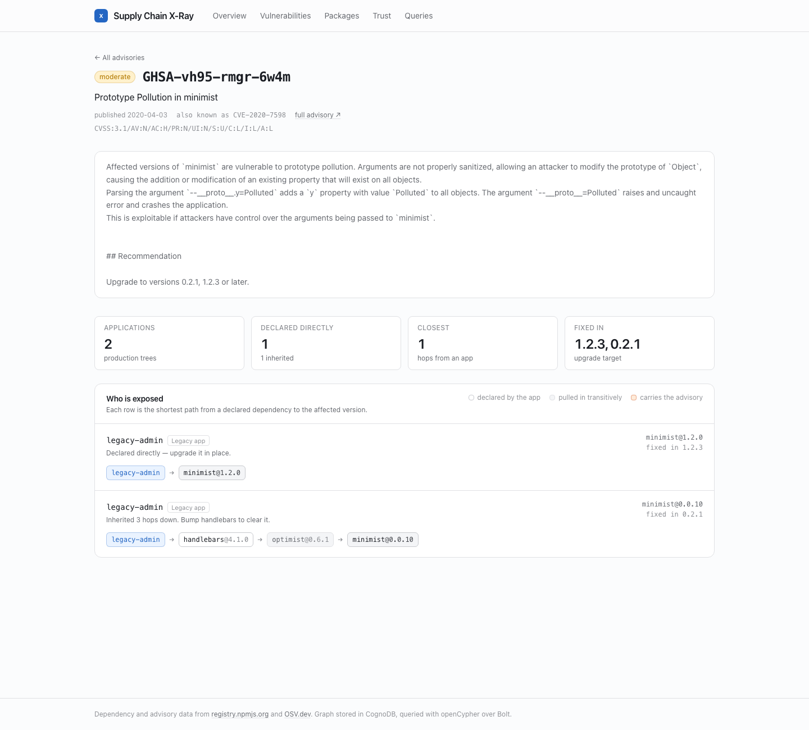

### Shared choke points
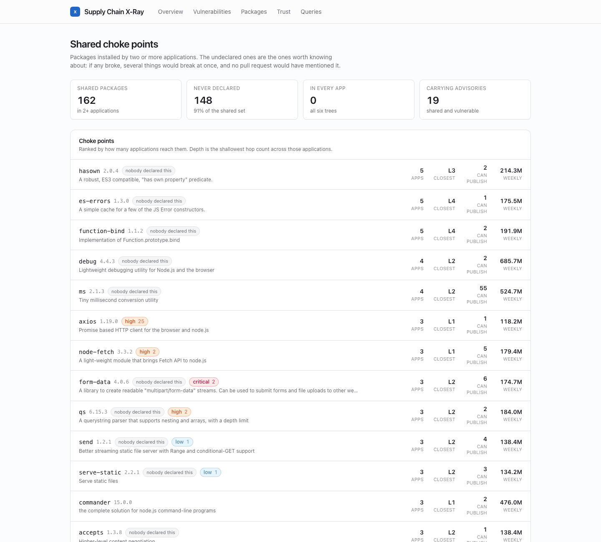

### One package: versions, publish rights, and what pulls it in
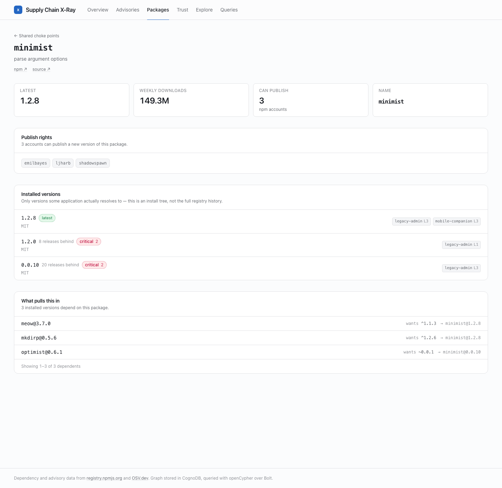

### Trust concentration
The top 5 npm accounts can publish to **40%** of the installed packages — 403 of 1,019. 421 accounts reach you only indirectly, 130 sit four or more hops down, and 328 packages have exactly one account able to publish them.

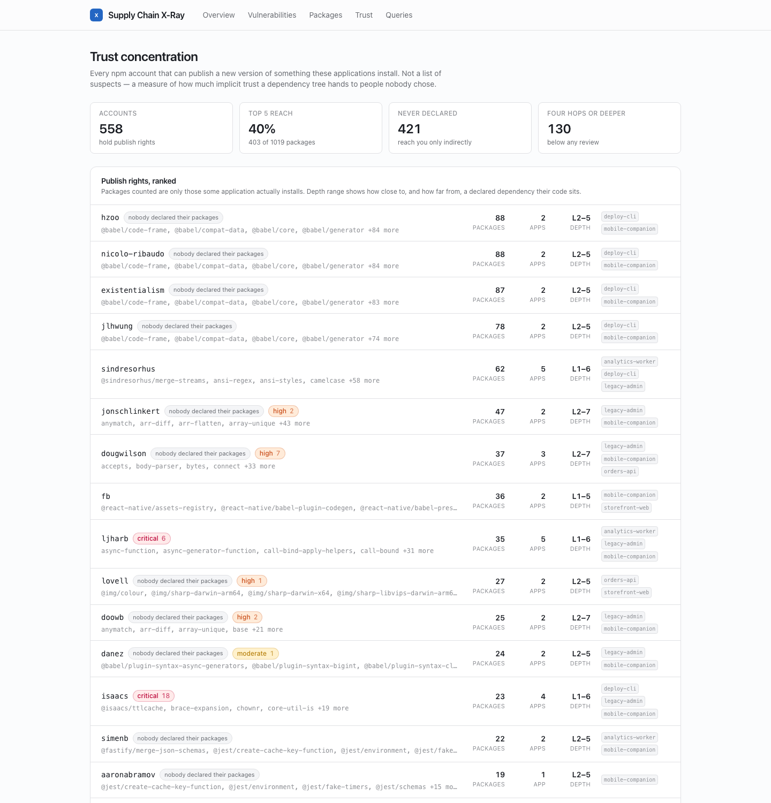

### Every query, documented in the app
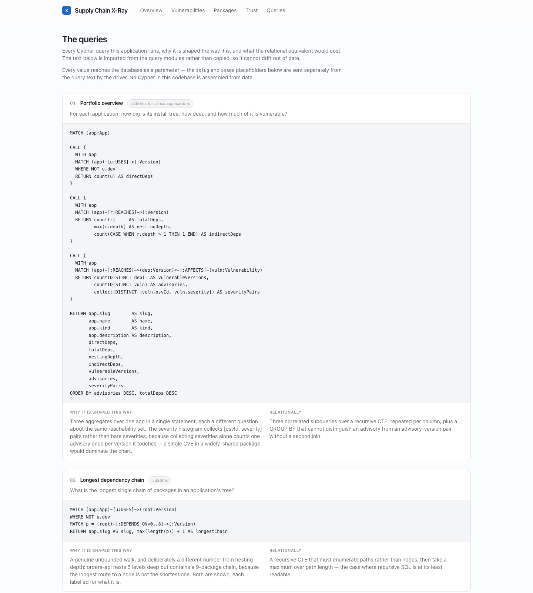

Regenerate with `./scripts/screenshots.sh` after a UI change, so they cannot go stale.

---

## Setup

### 1. Create a CognoDB instance

1. Sign up at [console.cognodb.com/signup](https://console.cognodb.com/signup) — free tier, no credit card.
2. Create a free **c0** instance and pick a region. It provisions in under a minute.
3. Copy the connection details. You get a URI like `bolt+s://<instance-id>.databases.cognodb.com`, the username `cognodb`, and a generated password **shown exactly once** — save it immediately.

### 2. Configure

```bash
git clone https://github.com/abdulhanan-fauree/supply-chain-xray.git
cd supply-chain-xray
nvm use          # Node 22, pinned in .nvmrc
npm install
cp .env.example .env.local
```

Fill in `.env.local`:

```
COGNODB_URI=bolt+s://<instance-id>.databases.cognodb.com
COGNODB_USER=cognodb
COGNODB_PASSWORD=<the password shown once>
COGNODB_DATABASE=neo4j
```

`.env.local` is gitignored. Nothing in this repo contains credentials — [`.env.example`](.env.example) holds placeholders only.

### 3. Verify the instance supports what the app needs

```bash
npm run probe
```

CognoDB speaks openCypher over Bolt and works with the official Neo4j driver, but it is a reimplementation rather than Neo4j. This runs 15 capability checks against your live instance and writes [`docs/cognodb-capabilities.md`](docs/cognodb-capabilities.md). It found a real divergence — see [Capability notes](#capability-notes-cognodb-is-not-neo4j).

### 4. Load the graph

```bash
npm run seed     # loads the committed data/graph.json (~50s)
```

Idempotent — everything is `MERGE`, so re-running converges rather than duplicating. `npm run reseed` wipes first.

To rebuild the dataset from upstream instead of using the committed one:

```bash
npm run crawl                                  # ~5 min cold, ~5s cached
npm run crawl -- --max-packages 2000 --max-depth 8
```

### 5. Run

```bash
npm run dev      # http://localhost:3100
```

Port 3100 rather than 3000, to avoid colliding with whatever else is running locally.

### Other commands

| Command | What it does |
|---|---|
| `npm run probe` | Verify Cypher capabilities against the live instance |
| `npm run crawl` | Rebuild `data/graph.json` from npm + OSV |
| `npm run seed` / `reseed` | Load / wipe-and-load the graph |
| `npm run bench` | Time every query against the live instance |
| `npm test` | Unit tests (59 cases, `node:test`) |
| `npm run typecheck`, `npm run lint` | Static checks |
| `./scripts/screenshots.sh` | Regenerate README screenshots |

---

## The main queries

All twelve are documented in the running app at [`/queries`](src/app/queries/page.tsx), which **imports the Cypher from the query modules** rather than transcribing it — so the documentation cannot drift from what executes.

**Every value reaches the database as a parameter.** No Cypher in this codebase is assembled from data; `$slug` and `$name` are sent separately from the query text by the driver.

### Blast radius — the query the app exists for

```cypher
MATCH (app:App {slug: $slug})-[reach:REACHES]->(dep:Version)<-[:AFFECTS]-(:Vulnerability)
WITH DISTINCT app, dep, reach.depth AS depth
CALL {
  WITH app, dep
  MATCH (app)-[u:USES]->(root:Version)
  WHERE NOT u.dev
  MATCH p = (root)-[:DEPENDS_ON*0..8]->(dep)
  RETURN [n IN nodes(p) | n.id] AS chain, u.range AS entryRange
  ORDER BY length(p) ASC
  LIMIT 1
}
RETURN dep.id AS versionId, depth, chain, entryRange
```

An 8-hop traversal returning the path itself. The outer match narrows to vulnerable versions *before* any path finding starts — that scoping is what makes it affordable (see [Performance](#performance)).

### Trust concentration — if one account were compromised today

```cypher
MATCH (maintainer:Maintainer)-[:MAINTAINS]->(pkg:Package)
MATCH (pkg)-[:HAS_VERSION]->(version:Version)<-[reach:REACHES]-(app:App)
RETURN maintainer.npmUser AS npmUser,
       count(DISTINCT pkg)     AS packages,
       count(DISTINCT app)     AS appsReached,
       min(reach.depth)        AS minDepth,
       max(reach.depth)        AS maxDepth
```

A three-hop walk from a person, through the packages they can publish, to the versions installed, to the applications exposed — aggregated over the *transitive* set. `hzoo` can publish 88 installed packages sitting between 2 and 5 hops down.

### Six degrees of separation

```cypher
MATCH (from:Package {name: $from})-[:HAS_VERSION]->(start:Version)
MATCH (to:Package {name: $to})-[:HAS_VERSION]->(finish:Version)
MATCH p = shortestPath((start)-[:DEPENDS_ON*1..8]->(finish))
RETURN [n IN nodes(p) | n.id] AS chain, length(p) AS hops
```

Verified live: `express` reaches `ms` in two hops, via `debug@2.6.9`.

### License obligations

Filters on a category computed at load time from the SPDX expression, then finds the chain responsible. The categoriser **decomposes** expressions rather than pattern-matching them: `(BSD-3-Clause OR GPL-2.0)` is a *choice*, so the least restrictive operand governs, while `AND` binds every operand at once. Both cases are covered by tests.

Real finding: `storefront-web` carries 14 weak-copyleft dependencies, all of sharp's LGPL libvips binaries, pulled in through Next.js at depth 3.

---

## Architecture

```
src/
  app/                     Next.js 16 App Router — server components only
    page.tsx               Portfolio dashboard
    apps/[slug]/           Blast radius, fix points, depth, licenses
    vulnerabilities/       Advisory list + reverse blast radius
    packages/              Choke points + package detail
    maintainers/           Trust concentration
    queries/               Self-documenting query catalogue (static)
  components/
    dependency-chain.tsx   The path ribbon — the core visual
    db-error.tsx           Failure-mode UI + withDbFallback
    primitives.tsx         Severity badges, stat tiles, skeletons
  lib/
    config.ts              Traversal depth, batch and page sizes, timeouts
    env.ts                 zod-validated config, result type not throw
    db.ts                  Driver singleton, DbError taxonomy, typed reads
    records.ts             Checked reads over a Bolt record
    model.ts               Labels, relationship types, row types
    severity.ts            Severity ranking and aggregation
    version-id.ts          name@version parsing and comparison
    queries/               One module per view; all Cypher lives here
scripts/
  probe.ts                 Capability verification
  crawl.ts                 Dataset builder (no database)
  seed.ts                  Loader (no network)
  bench.ts                 Query timing
  screenshots.sh           README image regeneration
  lib/
    crawler.ts             Breadth-first manifest walk
    reachability.ts        BFS that materialises REACHES
    dataset.ts             Deterministic ordering and summary
    registry.ts            npm registry client, SPDX categoriser
    osv.ts                 OSV client, alias clustering, range matching
    http.ts                Cached, retrying, concurrency-limited fetch
tests/                     59 unit tests (node:test)
data/graph.json            The committed, reproducible dataset (1.6 MB)
```

**Crawl and load are separate steps.** A registry outage cannot leave the graph half-written, and a reviewer with no network can still seed from the committed artifact.

**The dataset is deterministic** — the same manifests produce the same bytes, verified across consecutive runs. Two things are load-bearing for that. The package budget is checked between traversal levels rather than inside concurrent workers, because workers observing different counts depending on interleaving made the graph vary run to run. And the OSV batch cache is keyed by request *contents* rather than list position, so a one-entry shift in the package list cannot silently re-query upstream and pick up a different answer.

**The driver never reaches the browser.** Every query runs in a server component.

### Shared modules

The pieces several layers agree on are factored out rather than reimplemented per call site:

| Module | Responsibility |
|---|---|
| `lib/config.ts` | Traversal depth, batch and page sizes, driver timeouts |
| `lib/records.ts` | Typed reads over a Bolt record — no casts in the query layer |
| `lib/severity.ts` | Severity ranking, aggregation and display order |
| `lib/version-id.ts` | Parsing and comparing `name@version` identifiers |
| `lib/queries/fragments.ts` | Cypher shared by three queries, defined once |

`records.ts` earns its place: mapping an untyped Bolt record otherwise means a cast per field, and a cast silences the compiler without checking anything — rename a column and `record.slug as string` yields `undefined` typed as `string`, failing somewhere unrelated. The readers check and throw naming the column, which turns a schema mismatch into an immediate, locatable error.

`fragments.ts` holds the "shortest chain from a declared dependency" subquery that three queries need. Duplicated, a change to the dev-dependency filter or the depth bound had to be applied in three places and would diverge in whichever was missed.

### Pagination

The long lists — advisories, choke points, trust accounts, single-maintainer packages, dependents — paginate through **search params rather than client state**. That buys three things worth more than the interactivity: a page of results is a shareable link, the back button behaves, and the list reads with no JavaScript. Out-of-range input is clamped rather than rejected, so `?page=0`, `?page=999` and `?page=banana` all resolve to a real page instead of an error or a blank screen. Page 1 is the canonical URL with no param, and the trust page paginates two independent lists through separate params (`?trust=2&sole=3`).

The trade-off is that reading search params makes those routes dynamic, so they lose static prerendering. Worth it: `/packages` was a single 613 KB page and is now 136 KB.

### Error handling

`DbError` carries a five-way taxonomy — `unconfigured`, `unreachable`, `unauthorized`, `query`, `timeout` — each with user-facing copy written up front. Every page renders through `withDbFallback`, so a page either gets its data or gets an explanation; never a stack trace, a 500, or a half-rendered shell.

Verified by pointing the application at a non-existent host: it returns **HTTP 200** with a card reading *"The CognoDB instance may be paused, still provisioning, or blocked by the network"*, and the raw database message demoted into a collapsed `<details>`. Driver timeouts are set against that path rather than against protocol defaults, which took roughly 10s to surface the card; it now takes about 5s.

Detail pages distinguish three outcomes rather than two. A record that does not exist is a 404; a database that cannot answer renders the error state. Collapsing the second into the first would tell someone their advisory does not exist when the instance is merely paused.

---

## Capability notes: CognoDB is not Neo4j

`npm run probe` reports 13 of 15 checks passing. APOC is absent (expected, and it confirms the app is pure openCypher). The other failure changed how every traversal in this codebase is written.

In Neo4j, `-[rels:TYPE*1..8]->` binds `rels` to a **list of relationships**, so `none(r IN rels WHERE r.optional)` is the natural way to filter an edge property mid-traversal. CognoDB binds it to a **Path**, and list functions reject it:

```
none() requires list, got *types.Path
size() requires string or list, got *types.Path
```

The fix is to name the path and go through `relationships()`:

```cypher
MATCH p = (a)-[:DEPENDS_ON*1..8]->(b)
WHERE none(r IN relationships(p) WHERE r.optional)
```

Ten spellings were tested against the live instance. Everything works once the path is named — `nodes(p)`, `relationships(p)`, `length(p)`, `size()`, `all()`, `any()`, `none()`, `reduce()`, list comprehensions. So every traversal here names its path, and the Neo4j spelling is kept as a **deliberately failing check** so a future CognoDB release that fixes it shows up as a `SURPRISE` row rather than going unnoticed.

Also worth knowing: the instance reports itself as `Neo4j/5.26.0` over Bolt 5.4, and `neo4j-driver` is pinned to `^5` for that range.

---

## Performance

The free c0 instance is burstable **0.5 vCPU / 256 MB RAM**. `npm run bench` times every query against it, warming the connection pool first and judging on the median — an outlier there is CPU credit exhaustion, not a property of the query.

| Query | Median |
|---|---|
| Graph totals | 730ms |
| Portfolio dashboard | 1113ms |
| App header | 654ms |
| Blast radius (worst app) | 1288ms |
| Depth histogram | 654ms |
| License obligations | 652ms |
| Trust concentration | 1606ms |

Three findings shaped the query layer, none of which were obvious before measuring on the real instance.

**`max(length(p))` is cheap here; per-pair `shortestPath` is not.** Path length over a bounded variable-length match runs in ~520ms for all six applications. A `shortestPath` evaluated once per (source, target) pair exceeds the 20s query timeout, because it solves several hundred independent searches. The two look interchangeable and are not, which is why nesting depth is materialised and longest chain is live.

**Nesting depth and longest chain are different measures.** `orders-api` nests 5 levels deep but contains a 9-package chain: the longest route to a node is not the shortest one, and four of the six applications differ. Both are computed and each is labelled for what it is.

**Asking a narrow question once per row dominates cost.** Two queries had this shape. Blast radius searched for a path per *advisory* when findings land on far fewer distinct versions, so the same path was found repeatedly. Trust concentration ran an advisory subquery per *maintainer* when only a small minority maintain anything with an advisory against it. Splitting each into two concurrent queries joined on a small map took them from 2.6s to 1.3s and from 3.9s to 1.6s.

In production every page prerenders or caches and serves in **5–8ms**; `revalidate = 60` means the traversals run once a minute rather than once per visitor.

---

## Data provenance

Everything about the graph is real and fetched live:

- **Dependencies, versions, licenses, maintainers, download counts** — [registry.npmjs.org](https://registry.npmjs.org). The abbreviated packument for dependency data (one to two orders of magnitude smaller than the full document; the trade-off is no publish dates, hence `releasesBehind` on `:Version`), the version document for per-version licenses, `/latest` for current maintainers.
- **Advisories** — [api.osv.dev](https://api.osv.dev), `querybatch` then one fetch per advisory id.

The six application manifests are **hand-authored but realistic**: real package names, real semver ranges, chosen to give the graph different topologies, deliberate overlap, and one deliberately neglected app pinned to versions that carry published advisories. Everything they point at — the entire transitive closure, every license, every maintainer, every advisory — is fetched, not invented.

**Advisories are deduplicated by alias cluster.** OSV routinely ships two GHSA records for one issue: `GHSA-35jh` and `GHSA-r5fr` are both CVE-2021-23337 in lodash and each lists the other as an alias. Left alone, lodash reported 6 vulnerabilities where it has 4, and a triage tool that inflates its own counts is worse than no tool. Union-find over ids and aliases collapses them; where a cluster disagrees about the fix, the **highest** fixed version is kept, since that is the one clearing every record in the cluster.

### One honest caveat

No advisory in this dataset spans more than one application. The vulnerable versions are pinned old releases specific to `legacy-admin`, while the widely-shared packages (`hasown`, `es-errors`, `function-bind`) are all current and clean. The advisories page says so explicitly rather than leaving a headline implying overlap the data does not contain. That is a real finding about this portfolio, not a missing feature.

---

## Deployment

```bash
npm run build && npm run start
```

Deployed on Vercel's free tier with the same three environment variables. All six application pages prerender at build time via `generateStaticParams`; if the database is unreachable during a build, it returns `[]` and pages render on demand rather than failing the deploy.

---

## Licence

MIT. Advisory data from OSV.dev under its own terms; package metadata from the npm registry.
